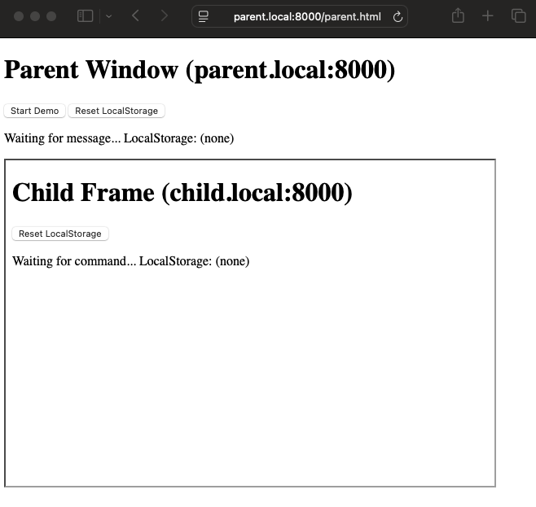

# PostMessage Demo

This repository demonstrates cross-domain communication using `postMessage` between a parent window and an iframe (child window) hosted on different domains. This demo is designed to run locally using two domains simulated via `/etc/hosts`.

## Setup

### 1. Update Your Hosts File (MacOS)

Edit your `/etc/hosts` file (with `sudo`) to include the following lines:

```plaintext
127.0.0.1    parent.local
127.0.0.1    child.local
```

### 2. Starting the Demo

1. Open a Terminal and navigate to the root directory:

```bash
cd /path/to/postmessage-demo
```

2. Start a local HTTP server on port 8000:

```bash
python3 -m http.server 8000
```

3. Open your browser and navigate to http://parent.local:8000/parent.html

### Screenshots

Here are a couple of screenshots from the demo:

**Before the Demo Starts:**



**After the Demo is Complete:**


### How It Works

1. *Start the Demo*: Click the "Start Demo" button on the parent page. This sends a "start" message to the child frame using postMessage.

2. *Child Receives the Message*: The child page listens for the "start" message, updates its status text, and sends back a reply ("Hello from child!").

3. *Parent Receives the Reply*: The parent page listens for messages from the child, verifies the origin, and updates its status text upon receiving the message.
